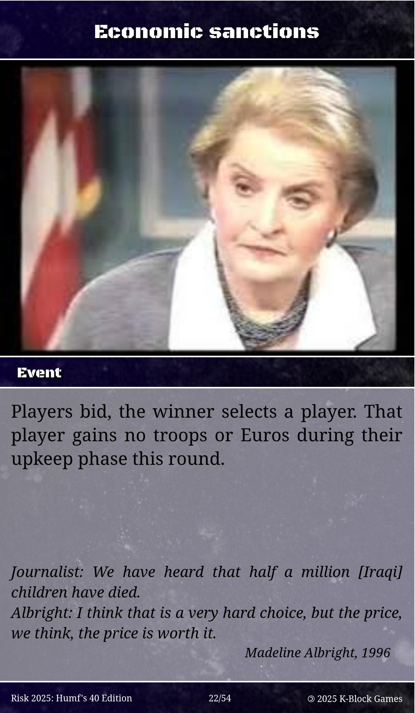
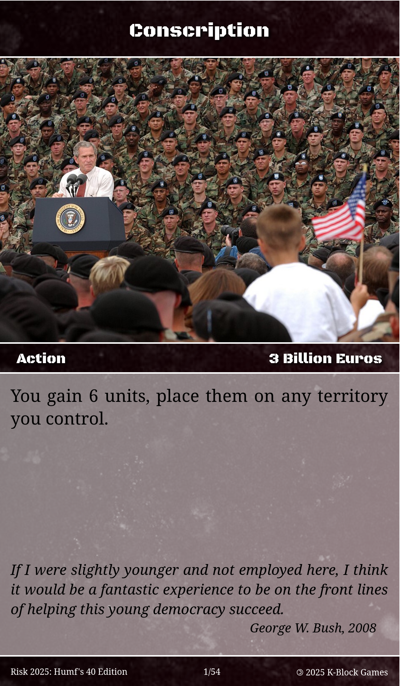

# Introduction

# Differences from Classic Risk

## Money
Players are able to mobilise financial resources in their pursuit of world domination. Money is counted in billions of Euro, represented by tokens.

Money may be used to:
- Activate an [Action card](#action-cards)
- [Bid](#bidding) for turn order or another advantage
- Buy additional units or cards in your [upkeep](#upkeep)

Money is gained in your [upkeep](#upkeep) at the same time and at the same rate as you gain units.

## Event Cards
Event cards are played at the start of each game round, after bidding for turn order. They have a variety of effects, including changing the games rules. 

Event Cards come into force as soon as they are played and unless otherwise stated last for the duration of a single game round, after which they are discarded.

### An example of an Event card
Action cards are *blue* and consist of the following:
- A title, located at the top of the card
- Card type, located on the left of the centre bar, this will always be "Event" for Event cards
- Effect, describing the effect of the card
- A quote



## Action Cards
Action cards *replace* the Country cards used to gain additional units in Classic Risk. They have a variety of effects on the game as specified on the card itself.

### An example of an Action card
Action cards are *red* and consist of the following:
- A title, located at the top of the card
- Card type, located on the left of the centre bar, this will always be "Action" for Action cards
- Cost, located on the right of the centre bar
- Effect, describing the effect of the card
- A quote



### Gaining an Action card
Action cards may be gained in the following ways:
- Purchased with Euro in a player's [Upkeep phase](#upkeep)
- At the end of a player's [Attack phase](#attack) if a player has taken a territory this turn
- As the result of Action cards

### Hand Limit
A player may have no more than seven Action cards in their hand at any given time. If you would draw cards exceeding the Hand Limit, discard cards from your hand until no more than seven remain.

### Using an Action card
Unless otherwise stated on the card, Action cards may be used at any point during the game, as an "Instant" in Magic nomenclature. Try to time their use to your maximum advantage.

To play an Action card, announce that you are playing the card, pay its cost, and reveal it to the other players. 

Take a polite moment to allow other players to respond. If no other players wish to play a card of their own in response to your card, resolve its effect and place the card in your discard pile.

### Resolving conflicting cards
Action Cards may be played in response to other Action cards, often to counteract their effect.

When an Action card is played in response to another, place both cards face up on the table in full view of all players. Additional cards may continue to be played, and should be placed alongside the other cards in the order in which they are played.

Cards are resolved on a *last in first out* basis, meaning cards are resolved in the reverse order they are played. The last card to be played trumps previous cards. If you've played _Magic the Gathering_ before, this should all be very familiar.

Simple two-card example:
- Ian plays "Conscription" to gain 6 troops on Alaska, and pays 
- Humfrey then plays "Socialised Losses" on Ian to make him lose 6 billion Euro
- Both players have paid the cost of their Action cards
- Ian only had 3 billion Euro before playing his card, and loses his money _before_ "Conscription" comes into effect, countering it
- Ian has been fucked-over properly

### When the last Action card is drawn
Shuffle the discard pile to form a new Action deck.

Search the Event deck for a card called "Accelerationism", shuffle the deck and put it into play.

## Bidding
Throughout the game, players are required to "bid" for an advantage. Bidding is required to determine turn order each round, but is also used to determine order of placement during setup, and as an effect of certain cards.

To bid, each player secretly places Euro tokens equal to their bid in one hand. Players may bid any number of Euros, from nothing up until the total they possess.

All players agree that they are ready, and simultaneously reveal the bid in their hands. All bid Euro is returned to the bank.

The player with the highest bid wins, followed by the player with the second-highest and so forth. 

All ties are decided by dice roll, see [General Principles](#general-principles).

When bidding for turn order, bids determine *the choice* of order, with the winner choosing their position first, second-place second and so forth. A winner may thus choose to go first, last, or in any position they consider favourable.

## The Singularity
Risk 2025 has a special end-game condition called "The Singularity", which is triggered when the last Event card is drawn.

If the Singularity is reached, the game ends immediately and the human race is destroyed by runaway climate change, global thermonuclear war, rogue AI, a vengeful God, aliens, a meteorite, nanobots, and a plague _all at once_.

To see who won that nice bottle of champagne in the Titanic's raffle, score yourselves accordingly:
- 1 territory = 3 points
- 1 card = 2 points
- 1 Euro = 1 point
- 1 unit = 1 point
- You also score points for any basic continent bonuses you would gain if you weren't busy eating radioactive sheep, i.e., Australia = 2 points, Asia = 7

The "winner" is the player with most points. No, you don't get to Mars, or survive in your bunker to repopulate the world, or save the world at the last minute with your vast wealth and resources.

## General principles

### Scheming
There is no prohibition on player coordination. Players are free to trade cards, money, units and favours.

### The dice decide
If there is any ambiguity or disagreement over anything, roll a die and the highest roll wins.

### There can only be one...
If a card specifies in the definite article, e.g., "The player with the most Euros" and two players have equal amounts of money, roll a die to determine the outcome. See also [bidding](#bidding).

### ...But at least one
If a card would result in no units being left on a territory, the maximum effect is limited to ensure one unit remains in place.

### And no less than zero
There is no negative money, cards or units. If a player has 3 billion Euro and loses 6, they have zero Euro.

# Playing the game
The game is setup as described as below, and continues in the following loop until a game-ending condition is reached:
```Game Rounds -> Player turns -> Phases ```

## Setup

### Gather required equipment
To play this game, you will need:
- This rulebook and the Risk 2025 Action and Event decks
- One classic Risk set, including a deck of Country cards
- Tokens to represent Euros, the game's currency
- Several friends, a comfortable place to play, snacks, some brews

### Determine win conditions
Risk 2025 is compatible with the three main Classic Risk win conditions:
- World Domination: conquering all territories
- Capital Risk: conquering all capitals
- Secret Mission Risk: completing secret mission(s)

Refer to the Classic Risk rulebook for more information. Key considerations with respect to classic variants are:
- The winner is always determined at [the start of the game round](#determine-winner)
- In Secret Mission Risk, players must declare they have completed their objectives _as soon as they are completed_. They must remain in the game until the start of the next round to secure victory.
- [The Singularity](#the-singularity) may occur, ending the game before a Classical victory has been reached.

### Shuffle decks
Shuffle the blue Event deck and the red Actions deck thoroughly.

### Pool armies and EUR
All players take starting units and Euro based on the number of players:
| Number of Players | Starting Units | Starting Euro (billion) | Starting Cards |
|-------------------|----------------|--------------------------|----------------|
| Three players     | 35 units       | 12 billion Euro          | 5 cards        |
| Four players      | 30 units       | 9 billion Euro          | 4 cards        |
| Five players      | 25 units       | 6 billion Euro           | 3 cards        |
| Six players       | 20 units       | 3 billion Euro           | 2 cards        |

### Determine turn order
All players bid to determine both the order of setup and the first game round.

### Place units
Once the order of setup has been determined, players take turns placing one piece from their starting pool onto an unoccupied territory.

Once all 42 territories have been claimed, players may then continue placing units onto territories they already control. This continues until all players have placed all their starting pieces.

### Variant-specific actions
Place capitals or draw secret mission cards. Capitals are placed in the order defined above.

# The game round
The game consists of *rounds* in which each player takes exactly one *turn*. Each round proceeds in the following order:

## Determine winner
If any player has met a victory condition at the start of the game round, they have won the game. If more than one player has met a victory condition (this is possible in Secret Mission Risk), the game continues until only one player having met their win condition remains.

## Bid for turn order
Players bid to determine the order of play. 

This is not done in the first round, instead, the order is carried over from the setup bid, i.e., the player placing their troops first also plays first, and so forth.

## Draw Event card
Unless otherwise stated on the card, discard the last turn's Event card before drawing a new one.

The player going first draws an event card and its effects come into play for the remainder of the round.

## Player turns
Following the order determined whilst bidding above, players take their turns.

# Turn structure

## Upkeep
The Upkeep phase is the administrative portion of a player's turn, in which they make preparation for the rest of their turn. 

An Upkeep phase will typically involve a player receiving additional troops and Euro, and will often entail them purchasing units or cards.

### Receive base units and Euros

Units and Euro received during upkeep are calculated as:

$units, euros = \lfloor \frac{territories}{3} \rfloor$

Where:
- `territories` is the number of territories you currently control
- `⌊ ⌋` indicates rounding down to the nearest whole number

Place the new units on any territory you already occupy and take that many Euros from the bank.

For example:
11 territories = 3 armies and 3 billion Euros, 14 territories = 4 armies and 4 billion Euros, 17 territories = 5 armies and 5 billion Euros.

### Continent Bonuses
In addition to the units and Euros gained above, you receive units and Euros equal to your continent bonus, if applicable.

To receive a Continent Bonus, you must control all territories in a continent at the start of your upkeep.

Continent bonuses are as follows:

| Continent        | Units Received | Euros Received |
|------------------|----------------|-----------------|
| Australia        | 2              | 2 billion       |
| South America    | 2              | 2 billion       |
| Africa           | 3              | 3 billion       |
| North America    | 5              | 5 billion       |
| Europe           | 5              | 5 billion       |
| Asia             | 7              | 7 billion       |

### Purchase units and cards
Players may also purchase additional units and cards with Euros.

- 1 unit costs 2 billion Euros
- 1 card costs 3 billion Euros

## Attack phase

### Combat
Combat in Risk 2025 follows the same basic principles as Classic Risk, with some additional considerations for the new mechanics.

#### Declaring an Attack
To attack, choose a territory you control and an adjacent enemy territory. You must have at least two units in the attacking territory to initiate combat.

#### Rolling Dice
- The attacker rolls up to 3 dice, but no more than the number of units they have in the attacking territory minus one.
- The defender rolls up to 2 dice, but no more than the number of units they have in the defending territory.

#### Comparing Rolls
- Compare the highest die rolled by each player. If the attacker's die is higher, the defender loses one unit. If the defender's die is higher or tied, the attacker loses one unit.
- If both players rolled more than one die, compare the second-highest dice in the same way.

#### Resolving Combat
- Remove the appropriate number of units from the attacking and defending territories based on the dice results.
- The attacker may choose to continue attacking the same territory, attack a different adjacent territory, or end their attack phase.

#### Capturing a Territory
When the last defending unit is destroyed, the attacker must move units equal to at least the number participating in the attack from the attacking territory into the freshly-captured territory.

#### Using Action Cards in Combat
Players may play Action cards during combat to influence the outcome. Cards must be played in accordance with the rules outlined in [Using an Action card](#using-an-action-card).

#### Retreating
The attacker may choose to stop attacking at any time. The defender cannot retreat.

#### Special Rules
- If a card or Event modifies combat rules, those effects take precedence.
- Combat involving territories with special effects (e.g., Event card effects) must account for those effects as specified.

#### Winning a Card
If the attacker successfully captures at least one territory during their turn, they may draw an Action card at the end of their Attack phase.

#### Eliminating a Player
If a player eliminates another player by capturing their last remaining territory, the victorious player immediately takes all of the eliminated player's remaining Action cards and Euro tokens.

## Consolidation
At the end of your turn, you may move units between any two territories you control, provided they are connected by a continuous chain of territories you own. 
- You may only consolidate once per turn.
- Move any number of units, but at least one unit must remain in the originating territory.
